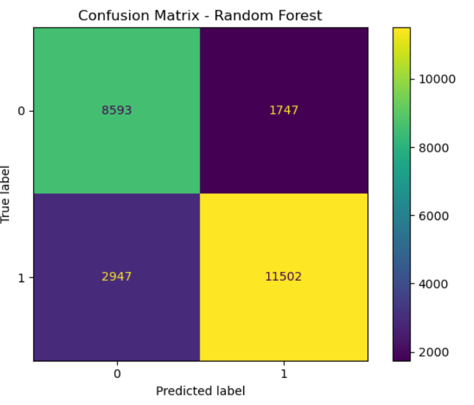
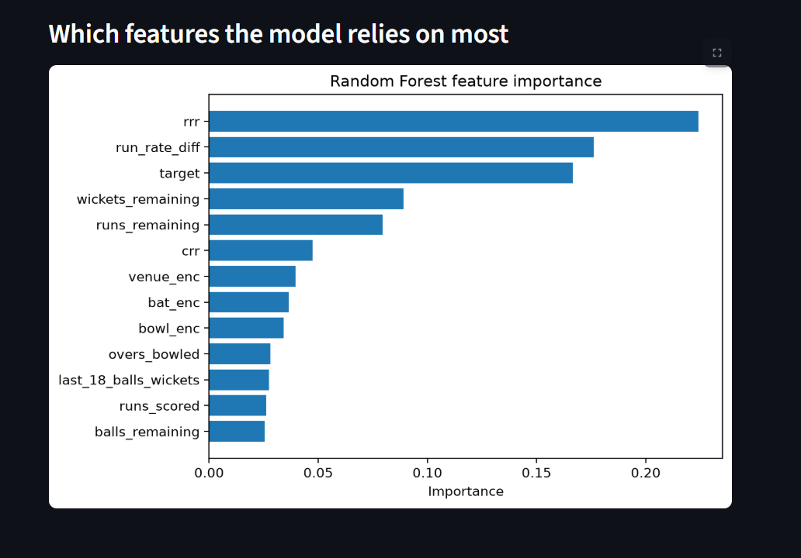
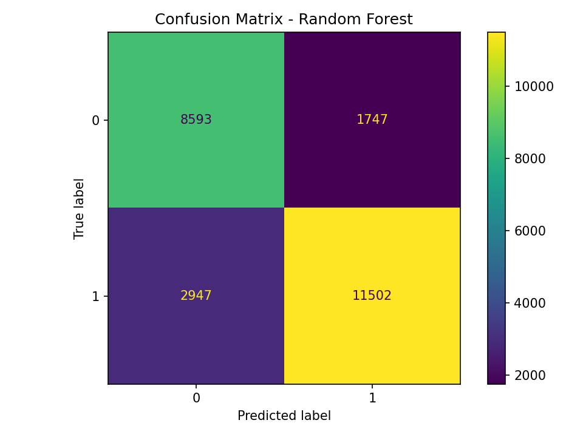

# 🏏 IPL Win Predictor

Predict the live win probability of an IPL run chase — ball by ball — from the current match situation.

**🔗 Live app:** https://ipl-win-predictor-hm.streamlit.app






---

## Overview

During the second innings of a T20 game, a fan can *feel* whether the chasing team is in control — but that gut feeling is really just a read on the run rate, the wickets in hand, and how much is left to get. This project turns that intuition into a number.

Given a live match state (target, current score, overs, wickets, teams, venue), the app returns the **probability that the batting team wins the chase** — trained on 16 seasons of real ball-by-ball IPL data.

It's an end-to-end machine learning project: raw data → feature engineering → model training → a deployed, interactive web app.

---

## Demo


Enter the match situation, hit **Predict**, and get a live win percentage for both teams, plus a chart of which features the model leans on most.

---

## How it works

### Data
- **Source:** [Kaggle — IPL Complete Dataset (2008–2024)](https://www.kaggle.com/datasets/patrickb1912/ipl-complete-dataset-20082020)
- `matches.csv` (one row per match) and `deliveries.csv` (**260,920** ball-by-ball rows)
- The model is trained on **second-innings** deliveries — each ball becomes one training example labelled with whether the batting team eventually won.

### Features (13 total)
Engineered from the ball-by-ball data to capture the live state of a chase:

| Category | Features |
|---|---|
| Run rates | `crr`, `rrr`, `run_rate_diff` |
| Progress | `runs_scored`, `runs_remaining`, `overs_bowled`, `balls_remaining`, `target` |
| Wickets | `wickets_remaining`, `last_18_balls_wickets` |
| Context | `bat_enc`, `bowl_enc`, `venue_enc` (label-encoded teams + venue) |

### Model
A **Random Forest classifier** (scikit-learn). Tree-based models were chosen over a neural network because the data volume and the tabular, rule-like nature of cricket situations suit them well — and they expose feature importance natively.

---

## Model performance

| Split | Test accuracy | Note |
|---|---|---|
| Random train/test split | 88.8% |  inflated by **data leakage** |
| Match-based split (`GroupShuffleSplit`) | **81%** | ✅ on completely unseen matches |


- **Data leakage:** a naïve random split puts balls from the *same match* in both train and test, so the model effectively sees the outcome during training. Splitting by `match_id` with `GroupShuffleSplit` fixed this and dropped the accuracy to an honest 81%.
- **Overfitting:** the unconstrained forest hit 99.9% train vs 79.2% test. Capping it with `max_depth=10` and `min_samples_split=10` closed the gap to a healthy **85.8% train / 81% test**.



### What the model relies on most
Feature importance confirmed the model learned real cricketing logic — required run rate dominates, followed by the target and current run rate:

`rrr` > `target` > `crr` > `runs_remaining` > `wickets_remaining`


---

## Tech stack

`Python` · `pandas` · `NumPy` · `scikit-learn` · `Matplotlib` · `Streamlit` · `Jupyter`

---

## Project structure

```
ipl-win-predictor/
├── data/                          # Kaggle CSVs (matches, deliveries)
├── 01_eda.ipynb                   # Exploratory data analysis
├── 02_visualizations.ipynb        # Charts & trends
├── 03_logistic_regression.ipynb   # First baseline model
├── 04_feature_engineering.ipynb   # Pre-match features
├── 05_final_model.ipynb           # In-match features, leakage fix, final model
├── model/                         # Saved model + encoders (.pkl)
├── app/
│   └── app.py                     # Streamlit web app
├── confusion_matrix.png
├── requirements.txt
└── README.md
```

---

## Run it locally

```bash
# 1. Clone the repo
git clone https://github.com/Hiti03/ipl-win-predictor.git
cd ipl-win-predictor

# 2. Install dependencies
pip install -r requirements.txt

# 3. Launch the app
streamlit run app/app.py
```

The app opens at `http://localhost:8501`.

---

## What I'd improve next

- **Player-level features** — bowler economy rate, batsman strike rate over the last 5 overs.
- **First-innings model** — currently it only predicts during the chase.
- **Calibration** — checking that a predicted 70% really wins ~70% of the time.

---

## Author

**Hitansh** · [GitHub @Hiti03](https://github.com/Hiti03)

Built as a hands-on machine learning project, applying each concept to real IPL data.
